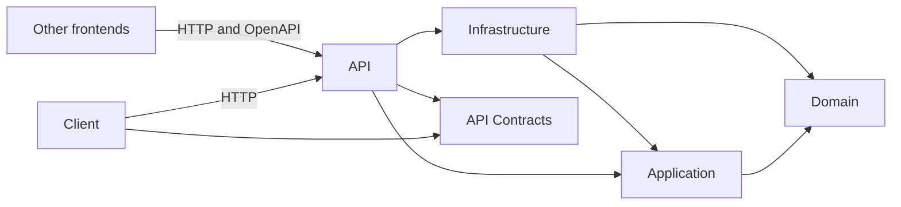

# Architecture Overview

## Product Direction

HouseholdLedger is a calendar-centered household ledger informed by Kakeibo.
Kakeibo is a Japanese approach to household accounting that combines recording
money with planning and reflection. Feature 001 establishes only the application
foundation. It does not yet implement entries, budgets, categories, savings, or
reflections.

The application is API-first. The built-in Blazor WebAssembly interface is one
replaceable client, not a privileged path into the application. A different web,
mobile, desktop, or automation client can use the HTTP API and checked OpenAPI
document without loading server implementation assemblies.

## Current Projects

The solution contains six production projects:

| Project | Current responsibility | References |
| --- | --- | --- |
| `HouseholdLedger.Domain` | Framework-independent home for future domain concepts and rules | None |
| `HouseholdLedger.Application` | Future use cases, orchestration, and application-owned ports | Domain |
| `HouseholdLedger.Infrastructure` | EF Core, PostgreSQL registration, and the persistence boundary | Application, Domain |
| `HouseholdLedger.Api.Contracts` | Convenience transport types for .NET clients | None |
| `HouseholdLedger.Api` | MVC, OpenAPI, CORS, configuration, and server composition | Application, Infrastructure, API Contracts |
| `HouseholdLedger.Client` | Standalone Blazor WebAssembly UI and HTTP consumption | API Contracts |

Arrows point from a project to what it references or consumes. Domain has no
project reference. API has no Client reference. Client has no reference to API,
Infrastructure, Application, or Domain.

## Contract Boundary

The canonical language-neutral contract is
[`src/HouseholdLedger.Api/openapi/v1.json`](../../src/HouseholdLedger.Api/openapi/v1.json).
It is generated from MVC controller metadata and checked into the repository.
The current document describes `GET /api/v1/health`, its JSON success response,
and its problem-details response.

`HouseholdLedger.Api.Contracts` is a convenience assembly for .NET consumers.
It is not canonical and does not replace OpenAPI. Keeping it dependency-free
prevents domain, application, persistence, and server implementation types from
becoming client requirements.

Contract changes must keep the controller behavior, checked OpenAPI document,
and convenience types aligned. Additive changes can remain under `/api/v1`.
Breaking changes require an approved compatibility decision and a new URL major.

The runtime document is compared with the checked artifact by default. Updating
the artifact requires an explicit `-Update` invocation; tests only compare and
never rewrite it. See [Development Setup](../development/setup.md) for the exact
commands.

## Frontend Boundary

The Client is a standalone Blazor WebAssembly application. It is built and
published independently from the API, reads its API base address from public
static configuration, and calls the API over HTTP. Browser-delivered
configuration is not a place for secrets.

Every Razor component and page must use a same-directory `.razor.cs` partial
class. Razor files contain markup and declarative binding only; lifecycle
methods, event handlers, parameters, injected services, and presentation logic
belong in code-behind. This universal rule includes application, routing,
layout, navigation, page, not-found, and error surfaces.

## Persistence Boundary

EF Core and Npgsql are confined to Infrastructure. The API composition root
supplies an explicit connection string to Infrastructure; Domain and Application
do not read configuration or depend on provider types. The current empty
`HouseholdLedgerDbContext` establishes a boundary without inventing ledger
tables. There is no initial migration because a real model does not yet exist,
and startup does not apply migrations automatically.

The API registers Infrastructure only when `ConnectionStrings:HouseholdLedger`
is nonblank and parses as a nonempty connection string. Registration configures
Npgsql but does not connect to PostgreSQL, create a database, inspect a schema,
or apply a migration during startup. An in-process test verifies this behavior;
the real-provider test remains a separate Podman-gated check.

PostgreSQL integration evidence must use the repository's isolated Podman
harness and a real PostgreSQL server. EF InMemory, SQLite substitution,
Testcontainers, Docker Desktop, and automatic startup migration are outside the
approved scaffold.

## Deliberate Omissions

AutoFixture, AutoMapper, and MediatR are not part of the architecture. Tests use
explicit setup, transport and domain mapping stays visible, and application
services are invoked through direct interfaces or concrete services registered
with built-in dependency injection.

Authentication, authorization, deployment, observability, and operational
health are unresolved future features. The current health endpoint proves the
HTTP boundary; it is not evidence that the application is production-ready.

The separate-process HTTP system smoke has no product project reference. It
launches built API output and verifies health and OpenAPI through HTTP. It does
not load the Client or a browser and therefore supplies no browser rendering,
viewport, interaction, or accessibility evidence.

## Related Documentation

- [Feature 001: Application Scaffolding](../features/001-application-scaffolding.md)
- [Development Setup](../development/setup.md)
- [Testing](../development/testing.md)
- [Dependency Governance](../development/dependency-governance.md)
- [Browser E2E Dependency Review](../development/browser-e2e-dependency-review.md)
