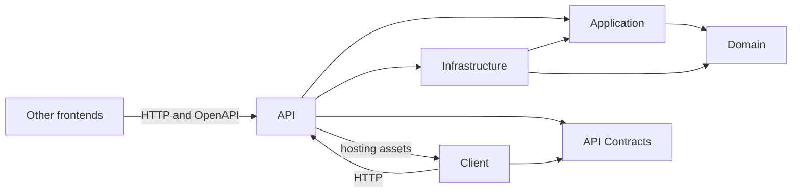

# Architecture Overview

## Product Direction

HouseholdLedger is a calendar-centered household ledger informed by Kakeibo.
Kakeibo is a Japanese approach to household accounting that combines recording
money with planning and reflection. The current ledger supports calendar expense
recording, named accounts, monthly intention, confirmed income, and comparison
of plans with persisted actuals. Schedules are expectation aids, never automatic
income records. Account destinations do not establish actual savings.

The application is API-first. The built-in Blazor WebAssembly interface is one
replaceable client, not a privileged path into the application. A different web,
mobile, desktop, or automation client can use the HTTP API and checked OpenAPI
document without loading server implementation assemblies.

## Current Projects

The solution contains six production projects:

| Project | Current responsibility | References |
| --- | --- | --- |
| `HouseholdLedger.Domain` | Framework-independent account, expense, income, plan, and settings rules | None |
| `HouseholdLedger.Application` | Use cases, orchestration, and application-owned ports | Domain |
| `HouseholdLedger.Infrastructure` | EF Core, PostgreSQL registration, and the persistence boundary | Application, Domain |
| `HouseholdLedger.Api.Contracts` | Convenience transport types for .NET clients | None |
| `HouseholdLedger.Api` | MVC, OpenAPI, CORS, configuration, and hosted-client composition | Application, Infrastructure, API Contracts, Client (hosting assets) |
| `HouseholdLedger.Client` | Standalone Blazor WebAssembly UI and HTTP consumption | API Contracts |

```mermaid
flowchart LR
    Infrastructure --> Application
    Infrastructure --> Domain
    Application --> Domain
    API --> Application
    API --> Infrastructure
    API --> Contracts[API Contracts]
    API -->|hosting assets| Client
    Client --> Contracts
    Other[Other frontends] -->|HTTP and OpenAPI| API
    Client -->|HTTP| API
```

Arrows point from a project to what it references or consumes. Domain has no
project reference. API references Client to publish its static assets, not to
invoke client behavior. Client has no reference to API, Infrastructure,
Application, or Domain.

## Contract Boundary

The canonical language-neutral contract is
[`src/HouseholdLedger.Api/openapi/v1.json`](../../src/HouseholdLedger.Api/openapi/v1.json).
It is generated from MVC controller metadata and checked into the repository.
The document describes health, accounts, date-scoped expenses and summaries,
settings, pay schedules, confirmed income, and monthly planning/review
and reflection endpoints, including receipt correction/removal, retry conflicts,
validation, and problem-details responses.

`HouseholdLedger.Api.Contracts` is a convenience assembly for .NET consumers.
It is not canonical and does not replace OpenAPI. Keeping it dependency-free
prevents domain, application, persistence, and server implementation types from
becoming client requirements.

Contract changes must keep the controller behavior, checked OpenAPI document,
and convenience types aligned. Additive changes can remain under `/api/v1`.
Breaking changes require an approved compatibility decision and a new URL major.

The runtime document is compared with the checked artifact by default. Updating
the artifact requires an explicit `-Update` invocation; tests only compare and
never rewrite it. See [Development Setup](../development/setup.md) for the exact
commands.

## Frontend Boundary

The Client is a Blazor WebAssembly application hosted by the API in the default
deployment. Publish the API to include the Client assets. Client requests use
HTTP and public configuration; a separately hosted frontend can use the same
contract with explicitly configured CORS origins. Browser-delivered
configuration is not a place for secrets.

Every Razor component and page must use a same-directory `.razor.cs` partial
class. Razor files contain markup and declarative binding only; lifecycle
methods, event handlers, parameters, injected services, and presentation logic
belong in code-behind. This universal rule includes application, routing,
layout, navigation, page, not-found, and error surfaces.

## Persistence Boundary

EF Core and Npgsql are confined to Infrastructure. The API composition root
supplies an explicit connection string to Infrastructure; Domain and Application
do not read configuration or depend on provider types. EF mappings and checked
migrations persist accounts, expenses, settings, schedules, receipt allocations,
monthly plans, standalone monthly reflections, and receipt request identities.
Receipt retry identities survive correction and deletion so a delayed retry
cannot recreate removed income. Normal startup never applies migrations or
seeds data.

The API registers Infrastructure only when `ConnectionStrings:HouseholdLedger`
is nonblank and parses as a nonempty connection string. Registration configures
Npgsql but does not connect to PostgreSQL, create a database, inspect a schema,
or apply a migration during startup. The explicit Development-only initializer
applies migrations and adds a sample fixture only to an empty ledger. Use
explicit schema migrations, not initialization, for an existing ledger.

PostgreSQL integration evidence uses isolated containers and a real PostgreSQL
server. Use the configured container CLI; Docker and Podman are environment
choices, not substitutes for PostgreSQL. EF InMemory and SQLite do not prove
provider-specific migrations, constraints, transactions, or idempotency.
Never point automated mutation tests at the manual-development database.

## Deliberate Omissions

AutoFixture, AutoMapper, and MediatR are not part of the architecture. Tests use
explicit setup, transport and domain mapping stays visible, and application
services are invoked through direct interfaces or concrete services registered
with built-in dependency injection.

Authentication, authorization, deployment, observability, and operational
health are unresolved future features. The current health endpoint proves the
HTTP boundary; it is not evidence that the application is production-ready.

The separate-process HTTP system smoke has no product project reference. It
launches built API output and verifies health and OpenAPI through HTTP. It does
not load the Client or a browser and therefore supplies no browser rendering,
viewport, interaction, or accessibility evidence.

## Related Documentation

- [Feature Index](../features/README.md)
- [Development Setup](../development/setup.md)
- [Testing](../development/testing.md)
- [Dependency Governance](../development/dependency-governance.md)
- [Browser E2E Dependency Review](../development/browser-e2e-dependency-review.md)
