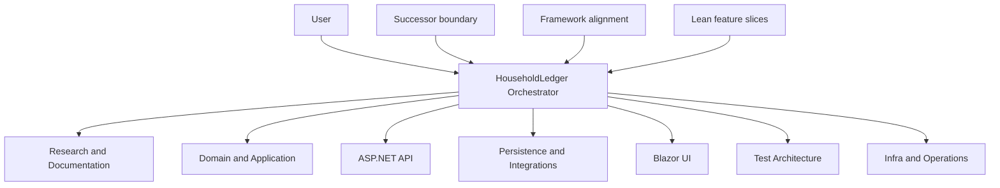

# GitHub Copilot Customizations and Guardrails Audit

**Audit date:** 2026-08-31

**Scope:** Active customizations governing the combined `BudgetRestart`
workspace and its `HouseholdLedger` successor repository. `BudgetExperiment`
was inspected only to distinguish inactive reference material from active
policy; none of its customizations is treated as HouseholdLedger policy.

**Overall verdict:** The customization design has a sound specialist model and
strongly repeats the successor/reference boundary. C-01 through C-06 are
resolved: the authoritative custom-agent fleet and concise always-on
guardrails now travel with HouseholdLedger, Domain/Application ownership no
longer permits architecture or cross-layer exceptions, test ownership is
unambiguous, feature-document readiness is consistent, and operational work
has one capable owner. Dependency admission and cross-layer security review
also have active triggers, accountable ownership, mandatory approval gates,
and evidence requirements. No identified policy conflict remains; additional
hardening opportunities remain in the lower-severity gaps.

The audit itself changed no customization or product file. The dated C-01
remediation recorded below later relocated the agent fleet and added the
always-on repository instruction; it did not modify product code.

## Executive Decision

The current fleet is usable with an attentive orchestrator, but it should not
be considered fully hardened. The highest-priority corrections are:

1. **Completed:** Put the authoritative agent fleet and product-wide guardrails inside the
   HouseholdLedger repository so they travel with the product.
2. **Completed:** Remove the Domain agent's exceptions that permit old architecture or
   cross-layer implementation to leak into Domain/Application ownership.
3. **Completed:** Define one test-ownership rule shared by implementation specialists and
   Test Architecture.
4. **Completed:** Align Research and Documentation with the lean feature-document threshold.
5. **Completed:** Give operational work one explicit owner.
6. **Completed:** Give dependency governance and cross-layer security review
  explicit owners and approval gates.

Hooks or repository permissions may later enforce a small set of destructive
operation and path protections. They should supplement, not replace, the
policy corrections above.

## Evidence Boundary and Method

The audit inspected:

- all eight active custom agents, originally under the parent workspace
  `.github/agents` and now under `HouseholdLedger/.github/agents`;
- the parent successor instruction;
- both HouseholdLedger-local instruction files;
- the VS Code user prompts directory and customization-related user settings;
- workspace searches for `copilot-instructions.md`, `AGENTS.md`, prompt files,
  project skills, hooks, and customization location settings;
- customization frontmatter and VS Code diagnostics; and
- relevant HouseholdLedger dependency and testing governance documents where
  active customizations refer to them.

The current session discovered and attached the nested HouseholdLedger
instructions. The repository-local agent fleet and
`.github/copilot-instructions.md` now make the core customizations portable
when HouseholdLedger is opened or cloned by itself. No
`chat.instructionsFilesLocations` override was found. The only matching
Copilot user setting was Next Edit Suggestions, which does not affect these
customization locations.

VS Code reported no diagnostics for the active agent and instruction
directories. This confirms no detected syntax problem; it does not prove that
the policies are mutually consistent or that prose guardrails are
deterministically enforced.

## Active Inventory

### Project-Owned Instructions

| Customization | Location | Discovery and role | Audit status |
| --- | --- | --- | --- |
| HouseholdLedger V2 Direction | [parent instruction](../../../.github/instructions/household-ledger-v2.instructions.md) | `applyTo: "**"`; successor boundary for the combined workspace | Intentionally retained as combined-workspace protection |
| HouseholdLedger Repository Guardrails | [always-on HouseholdLedger instruction](../../.github/copilot-instructions.md) | Default repository instruction; portable summary of product and safety non-negotiables | Added by C-01 remediation |
| Framework-Aligned Engineering | [HouseholdLedger instruction](../../.github/instructions/framework-aligned-engineering.instructions.md) | `applyTo: "**"`; framework, architecture, UX, accessibility, and operations exceptions | Healthy, concise, and currently discovered |
| Lean Feature Slices | [HouseholdLedger instruction](../../.github/instructions/lean-feature-slices.instructions.md) | Description-based discovery; feature scope, approval, and proportional evidence | Healthy policy, but no `applyTo` and contradicted by one agent |

HouseholdLedger now has an active root `.github/copilot-instructions.md` that
summarizes its repository-portable non-negotiables independently of focused
instruction matching and task discovery.

### Custom Agents

| Agent | Invocation | Primary ownership | Audit status |
| --- | --- | --- | --- |
| [HouseholdLedger Orchestrator](../../.github/agents/household-ledger-orchestrator.agent.md) | User-invocable; model invocation disabled | User communication, planning, routing, ownership, approval gates, and evidence synthesis | C-06 resolved; dependency and security decisions are mandatory stops |
| [Domain and Business Logic Specialist](../../.github/agents/domain-and-business-logic-specialist.agent.md) | Subagent only | Domain, application use cases, ports, and unit tests | C-02 resolved; framework and adapter boundaries are unconditional |
| [ASP.NET API Specialist](../../.github/agents/aspnet-api-specialist.agent.md) | Subagent only | HTTP transport plus unit and narrowly coupled ASP.NET integration tests changed with it | C-03 resolved; no project-wide test claim |
| [Persistence and Integrations Specialist](../../.github/agents/persistence-and-integrations-specialist.agent.md) | Subagent only | Adapters plus unit and narrowly coupled provider integration tests changed with them | C-03 resolved; no project-wide test claim |
| [Blazor UI Specialist](../../.github/agents/blazor-ui-specialist.agent.md) | Subagent only | UI plus unit, component, and narrowly coupled integration tests changed with it | C-03 resolved; higher-layer and shared tests excluded |
| [Test Architecture Specialist](../../.github/agents/test-architecture-specialist.agent.md) | Subagent only | Test-pyramid audits, shared test infrastructure, cross-component tests, system/browser tests, and independent gaps | C-03 resolved; exact-file handoff required for coupled tests |
| [Research and Documentation Specialist](../../.github/agents/research-and-documentation-specialist.agent.md) | Subagent only | Specifications, audits, research, and documentation | C-04 resolved; uses the Lean and Orchestrator readiness threshold |
| [Infra & Operations](../../.github/agents/infra-and-operations.agent.md) | Subagent only | Operations, complete dependency admission, supply-chain evidence, and cross-layer security review | C-05 and C-06 resolved; leaf reviewer with explicit implementation boundaries |

All agent names are unique. Every filename is the lowercase kebab-case form of
its display name, with established product spelling preserved for `aspnet` and
`household-ledger`. The Orchestrator's `agents` allowlist exactly matches the
seven specialist display names. Specialists are hidden from the agent picker,
remain model-invocable, and declare `agents: []` so they act as leaf workers.

### Skills, Prompts, Hooks, and User Customizations

| Type | Active project/user inventory | Consequence |
| --- | --- | --- |
| Project skills | None | No repository-owned reusable workflow packages |
| Project prompt files | None | No repository-owned focused slash-command workflows |
| Project hooks | None | No deterministic pre/post tool enforcement |
| User prompt/agent/instruction files | None; user prompts folder is empty | No hidden personal policy conflicts |
| Custom location settings | None found | Default discovery locations remain important |
| Extension-provided skills | Available in the current VS Code installation | Useful tooling, but not HouseholdLedger policy and not repository-portable |

The available extension skills cover project setup, agent customization,
session history, GitHub issue/PR workflows, Pylance workflows, and customization
diagnostics. They are supplied by installed extensions and may change with the
editor. They must not be cited as project guardrails or required contributor
capabilities unless HouseholdLedger explicitly adopts and documents them.

BudgetExperiment contains prompts, skills, agents, and migrated Copilot
instructions. They are inactive reference material for this audit. Loading or
copying them as HouseholdLedger policy would violate the active successor
boundary unless a specific lesson is deliberately re-established for the new
product.

## How Policy Currently Applies

The intended flow is:

This is a well-chosen pattern: the Orchestrator has no edit or execute tools,
and implementation is delegated to bounded specialists. However, users can
still work through the default VS Code agent. In that path, agent-body rules
such as TDD, secret handling, test ownership, and destructive-operation
restrictions are not automatically inherited. Only discovered instructions
and higher-level platform controls remain active.

Instructions guide model behavior. Agent tool aliases grant capabilities but
do not path-restrict them. A specialist with `edit` and `execute` can
technically edit another layer or `BudgetExperiment`; the body tells it not to.
No active hook deterministically blocks that action.

## Conflict Findings

### C-01 High: The Agent Fleet Does Not Travel with HouseholdLedger (Resolved 2026-08-31)

At audit time, all eight custom agents were stored in the parent
`BudgetRestart/.github/agents` directory. The active direction correctly said
the parent repository was temporary and must not be published, while
HouseholdLedger is the product repository.

**Impact before remediation:** Opening or cloning HouseholdLedger by itself
lost the Orchestrator and every specialist. Contributors and future sessions
then received only the two focused local instructions, so the strongest
ownership, TDD, Git, resource-isolation, and evidence rules silently vanished.

**Resolution:** All eight tracked agent files were mechanically relocated to
[`HouseholdLedger/.github/agents`](../../.github/agents) with byte-equivalent
content, and the parent agent copies were deleted. The
[always-on HouseholdLedger instruction](../../.github/copilot-instructions.md)
now summarizes repository, product-direction, routing, secrets, operation, and
validation non-negotiables. The thin parent
[HouseholdLedger V2 Direction](../../../.github/instructions/household-ledger-v2.instructions.md)
remains unchanged as combined-workspace protection. No agent-body finding was
changed during C-01 remediation.

### C-02 High: Domain Ownership Had Architecture Escape Clauses (Resolved 2026-08-31)

The Domain agent says BudgetExperiment architectural patterns may be copied
when they match HouseholdLedger conventions. It also qualifies framework
independence and prohibitions on adapters, controllers, and UI state with
exceptions for approved architectural patterns.

This conflicts with the successor instruction's requirement to retain lessons
without porting old implementation or accumulated architecture by default. It
also conflicts internally with the agent's stated ownership of
framework-independent domain and business logic. A local convention cannot
make EF Core, ASP.NET, database access, HTTP clients, or Razor state a Domain
responsibility.

**Impact:** The agent can justify cross-layer edits using a subjective
"approved pattern" exception, bypassing both first-principles design and the
Orchestrator's exclusive ownership model.

**Resolution:** Remove the exceptions. Permit reuse only of validated domain
language, behavior, invariants, edge cases, and test scenarios. Require all
transport, persistence, provider, and UI implementation to remain with their
specialists regardless of local architecture.

**Remediation:** The Domain agent now permits only validated domain language,
business rules, invariants, workflows, edge cases, user lessons, and test
scenarios to be recovered from BudgetExperiment. It explicitly prohibits
copying the reference architecture or implementation by default. Domain
framework independence and the prohibition on adapters, database access, HTTP
transport, API contracts, middleware, Razor components, and UI state are now
unconditional. Cross-layer requirements must return to the Orchestrator for
assignment to the owning specialist.

### C-03 High: Integration and Contract Test Ownership Overlapped (Resolved 2026-08-31)

API claims API unit and integration tests. Persistence claims adapter unit and
assigned provider integration tests. UI claims UI unit and integration tests.
Test Architecture simultaneously claims all component, integration, contract,
and end-to-end tests. The Orchestrator repeats both sets of claims.

**Impact:** A normal cross-layer feature can assign the same project or file to
two agents, directly violating exclusive writable ownership. Agents may also
reject necessary tests because another specialist appears to own them.

**Resolution:** Adopt one rule everywhere. Recommended boundary:

- implementation specialists own unit tests and narrowly coupled integration
  tests written with their production change;
- Test Architecture owns test-pyramid audits, shared test infrastructure,
  cross-component contract/integration tests, system tests, browser tests, and
  independently assigned coverage gaps; and
- only one agent receives a given test file in any work plan.

**Remediation:** The Orchestrator and all affected specialists now use this
boundary. Implementation specialists own unit tests and narrowly coupled
component or integration tests created or updated with their assigned
production behavior. Test Architecture owns test-pyramid audits, shared test
infrastructure, cross-component contract and integration tests, system and
browser tests, and independently assigned coverage gaps. Test project names do
not confer ownership, every test file has one writable owner, and coupled test
files may transfer to Test Architecture only after the production owner
releases them and the Orchestrator assigns them explicitly.

### C-04 High: Feature-Document Requirements Conflicted (Resolved 2026-08-31)

Research and Documentation says a feature document must be created before
implementation begins. The Orchestrator and Lean Feature Slices require one
only for a meaningful new product outcome or material behavior change and
explicitly exempt localized UI work, bug fixes, maintenance, and validation
tasks with clear acceptance criteria.

**Impact:** The same maintenance request can either proceed immediately or be
blocked for a specification and approval depending on which agent interprets
it. This recreates the ceremony the lean instruction was designed to remove.

**Resolution:** Copy the Orchestrator's meaningful/material threshold and
explicit exemptions into the Research agent. State that Research drafts a
feature document only when the Orchestrator classifies the work as requiring
one or the user requests one.

**Remediation:** Research and Documentation now creates a feature document only
when the Orchestrator classifies work as a meaningful new product outcome or
material behavior change, or when the user explicitly requests one. The agent
uses the same materiality definition as the Orchestrator and expressly exempts
localized UI changes, bug fixes, maintenance repairs, validation-only tasks
with clear acceptance criteria, documentation-only work, exploration, and
routine repository maintenance without product-behavior change. When a feature
document is required, its scope, acceptance criteria, assumptions, Definition
of Done, and explicit user approval remain mandatory before implementation.

### C-05 High: Infra Routing Contradicts Agent Capabilities (Resolved)

Before remediation, Infra & Operations routed some repository work to the
Orchestrator, although the Orchestrator is forbidden to edit or execute. It
routed CI/deployment work partly to Test Architecture, whose production
boundary excludes infrastructure. It alternated among `Infra & Operations`,
`Utility Fallback`, and `Orchestrator` as owners even though no agent named
Utility Fallback existed.

**Impact:** Operational work can be returned to an agent unable or forbidden
to perform it. Stale names also weaken model selection and completion reports.

**Resolution:** Make Infra & Operations the owner of repository maintenance,
tooling, build diagnostics, CI/CD, containers, deployment, and operational
configuration. Test Architecture should own test pipeline behavior only. The
Orchestrator coordinates but never becomes the implementation owner. Rename
the file to match the display name and remove migration-era wording.

**Remediation:** Infra & Operations now exclusively owns the listed
operational surfaces. Its policy limits Test Architecture to test design and
test-pipeline behavior, treats the Orchestrator only as the coordinator, and
returns non-operational work for reassignment instead of absorbing it. The
agent was renamed to `infra-and-operations.agent.md`, all fallback terminology
was removed, the `agent` and `todo` tools were removed, and `agents: []` now
technically enforces leaf-worker behavior.

### C-06 High: Dependency and Security Governance Has No Complete Active Owner (Resolved)

Before remediation, Lean Feature Slices preserved dependency-governance
approval, and the ordinary
[Dependency Governance](../development/dependency-governance.md) document had
a substantial review checklist, but no active instruction assigned the
complete review to an agent. The Orchestrator's explicit autonomous-delivery
stop list included migration, security/privacy, external services, core
deviation, and destructive operations, but omitted a new or updated
dependency.

Security ownership was similarly fragmented. API owned authentication
plumbing, Persistence protected credentials and outbound adapters, and Infra
owned operations, but no agent owned cross-layer threat review, secrets
policy, or security acceptance evidence.

**Impact:** A dependency can be treated as a routine lock-file update after it
is introduced, despite policy requiring review and approval first. Cross-layer
security work may be routed by convenience rather than accountable ownership.

**Resolution:** Assign dependency admission and cross-layer security review to
Infra & Operations or create a dedicated governance specialist. Add dependency
addition/update to the Orchestrator's mandatory stop list. Promote the minimum
dependency, secret, and security gates from ordinary docs into an active
instruction with precise triggers and an explicit owner.

**Remediation:** The always-on repository instruction now stops every new or
updated package, tool, runtime, image, browser, or downloaded asset before
manifest, lock-file, installation, or generated-output mutation. It assigns
the complete review to Infra & Operations and requires explicit user approval
of the recorded review and exceptions. The Orchestrator enforces the same
mandatory stop, sequences implementation through normal file owners, and
requires post-change closure and published-output evidence. Infra owns the
complete dependency checklist, supply-chain closure, cross-layer threat and
secrets-policy review, and consolidated security acceptance evidence without
absorbing product-layer implementation or retained-document ownership.

## Guardrail Coverage

| Guardrail | Current coverage | Assessment |
| --- | --- | --- |
| HouseholdLedger is the sole new-product target | Always-on local instruction, parent instruction, and every specialist | Strong and product-repository portable |
| BudgetExperiment is read-only reference | Always-on local instruction, parent instruction, and every specialist | Strongly repeated; prose-only enforcement |
| Parent repository must not be published | Parent instruction, Orchestrator, Infra | Clear; no deterministic remote-operation block |
| Kakeibo and calendar-centered product core | Orchestrator, Domain, Research | Strong and appropriately requires user confirmation for meaningful deviations |
| Framework and accessibility alignment | Always-matched local instruction plus UI agent | Strong |
| Lean feature scope and proportional evidence | Local instruction, Orchestrator, and Research | Strong and consistent after C-04 |
| TDD | API, Domain, Persistence agents | Good for those agents; absent from UI and default-agent policy |
| Test pyramid | Test Architecture and testing docs | Strong concept with C-03 ownership conflict resolved |
| Layer boundaries | Specialist bodies and Orchestrator | Detailed and consistent after C-02 and C-03 |
| Dependency admission | Always-on instruction, Lean instruction, Orchestrator, Infra, and governance doc | Complete owner, pre-mutation user approval, checklist, and post-change closure evidence |
| Secrets and sensitive output | Always-on instruction, Orchestrator, Infra, and specialist bodies | Global handling rule plus accountable cross-layer review |
| Destructive and remote operations | Orchestrator/Infra and specialist Git prohibitions | Broad prose coverage; no hooks or permissions enforce it |
| Parallel resource isolation | Orchestrator and every specialist | Strong and consistent |
| Evidence-based completion | Orchestrator and specialists | Strong and consistent |
| User approval state | Feature docs and agent prose | Required, but no single machine-checkable status convention |
| Documentation truthfulness | Research specialist | Strong |

## Additional Risks and Gaps

### G-01 Medium: Nested Instruction Discovery Is Fragile

The two product instructions are under `HouseholdLedger/.github/instructions`
while the current VS Code workspace folder is `BudgetRestart`. They were
discovered in this session, but no user setting explicitly registers the nested
location. Opening HouseholdLedger directly should discover them; other tools
or editor versions operating only from the parent default location may not.

The Lean instruction also has no `applyTo`, making it dependent on semantic
task discovery unless explicitly attached.

**Recommendation:** Make HouseholdLedger the normal workspace root for product
work. Add a suitable `applyTo` if lean policy should attach to every product
file operation, or split it into a short always-on policy and a detailed
description-triggered feature-planning instruction.

### G-02 Medium: No Always-On Product Guardrail Summary

There is no HouseholdLedger `.github/copilot-instructions.md` or `AGENTS.md`.
The framework instruction applies broadly, but it does not contain the
successor boundary, layer model, dependency gate, secrets rule, or validation
minimum.

**Recommendation:** Add a concise always-on HouseholdLedger instruction that
states only true non-negotiables and links to focused instructions. Avoid
copying long engineering documents into the context window.

### G-03 Medium: Default-Agent Work Bypasses Specialist Rules

The agent system assumes the Orchestrator is the only user-facing agent, but
VS Code cannot prevent a user from selecting the default agent. Product rules
that exist only in `.agent.md` bodies are therefore routing-dependent.

**Recommendation:** Put cross-cutting rules in active instructions. Leave
role-specific workflow and completion-report formats inside agents.

### G-04 Medium: Controls Are Advisory, Not Deterministic

No hook blocks writes under `BudgetExperiment`, edits outside an assigned
scope, destructive commands, or publication of the parent repository. Broad
`edit` and `execute` aliases are capability grants, not path restrictions.

**Recommendation:** First correct the policies. Then consider narrowly scoped,
reviewed `PreToolUse` hooks or repository permissions for only the highest-cost
actions. Hook scripts are executable security-sensitive code and must have a
named owner, tests, an escape procedure, and explicit approval before adoption.

### G-05 Medium: Approval State Is Human-Readable but Ambiguous

Agents require approved feature documents but do not define one authoritative
status schema. Existing feature and audit records have already demonstrated
stale or contradictory approval/completion claims.

**Recommendation:** Standardize a short feature header containing status,
approved scope revision, approval date, approval authority, completion state,
and supersession link. Audits should not infer approval from a later request
unless the policy explicitly permits that interpretation.

### G-06 Low: Infra Has Excess Capability and Stale Identity (Resolved)

Before remediation, Infra & Operations had `agent` and `todo` tools and lacked
`agents: []`, despite its leaf-worker rule. The filename and body retained
fallback terminology while the display name and Orchestrator called it Infra
& Operations.

**Recommendation:** Rename it consistently, remove `agent`, set `agents: []`,
and retain `todo` only if the agent has a demonstrated need for its own task
list.

**Remediation:** Completed with C-05. The normalized filename matches the
display name, stale fallback identity is gone, both `agent` and unused `todo`
were removed, and `agents: []` makes the specialist a technical leaf worker.

### G-07 Low: No Repository-Owned Reusable Workflows

There are no HouseholdLedger skills or prompts. This is not a defect by itself;
the current fleet can work without them. Repeated, stable workflows such as
feature readiness review, dependency admission evidence, and release
validation may eventually benefit from a focused skill or prompt.

**Recommendation:** Add one only after repetition demonstrates a stable
workflow. Do not create skills merely to duplicate instructions or ordinary
documentation.

## Healthy Controls Worth Preserving

- The Orchestrator is user-visible, cannot be invoked as a subagent, and lacks
  edit/execute tools. This is a strong separation of coordination from work.
- Specialist display names and the Orchestrator allowlist match exactly.
- Most specialists are leaf workers with `agents: []`.
- Production ownership is generally clear among UI, API, Domain/Application,
  Persistence/Integrations, Documentation, Testing, and Operations.
- The successor/reference boundary appears in every specialist and consistently
  prohibits unintended BudgetExperiment changes.
- Parallel work requires exclusive files, terminals, ports, databases,
  containers, browser profiles, sandboxes, and test data.
- Specialists require exact validation evidence and report unavailable or
  blocked checks as residual risk rather than success.
- Framework alignment requires a concrete concern, an alternative, and user
  confirmation instead of using "best practice" as an unsupported veto.
- Lean Feature Slices correctly limits approval renewals and final audits to
  material changes or explicit gates.
- Research and Documentation strongly separates verified facts, proposals,
  assumptions, and unresolved questions.

## Recommended Target Model

### Always-On Product Policy

Keep one concise HouseholdLedger-owned always-on instruction covering:

- successor/reference and repository boundaries;
- Kakeibo and calendar-centered direction;
- architecture and specialist ownership at one-sentence granularity;
- dependency, security/privacy, migration, destructive-operation, and external
  service approval gates;
- secrets and sensitive-output handling;
- focused executable validation and truthful reporting; and
- the rule that default-agent work must honor the same cross-cutting controls.

### Focused Instructions

Retain separate focused instructions for:

- framework, UX, accessibility, and architecture alignment;
- lean feature planning and approval;
- dependency and supply-chain governance;
- testing and evidence standards; and
- optional language/framework-specific conventions only when the codebase
  develops enough stable patterns to justify them.

### Agent Boundaries

Retain the current seven-specialist shape after correcting overlaps. It is
appropriately small for the architecture. Do not merge Documentation into the
Orchestrator or Testing into implementation agents; their independent review
value is real. Infra & Operations should be a named specialist, not a generic
fallback with broad delegation power.

### Enforcement

Use layers of control:

1. repository permissions and branch protection for remote safety;
2. concise active instructions for universal model behavior;
3. custom-agent tools and ownership for least privilege;
4. reviewed hooks only for deterministic, high-value local checks; and
5. CI for build, test, formatting, dependency, and policy evidence that must be
   independently repeatable.

## Remediation Plan

| Priority | Action | Owner | Completion evidence |
| ---: | --- | --- | --- |
| 1 | **Completed 2026-08-31:** Move authoritative agents into HouseholdLedger and retain only combined-workspace boundary guidance in the parent | Infra & Operations | Eight byte-equivalent local agents, zero parent agents, and a local always-on instruction |
| 2 | **Completed 2026-08-31:** Remove Domain architecture and cross-layer exceptions | Domain policy owner plus Research review | Domain agent has unconditional framework and adapter boundaries |
| 3 | **Completed 2026-08-31:** Reconcile test ownership in all affected agents and Orchestrator | Test Architecture plus affected specialists | Ownership follows assigned work; each test file has one writable owner |
| 4 | **Completed 2026-08-31:** Align Research feature-document rules with Lean and Orchestrator | Research and Documentation | Local fixes no longer trigger mandatory feature specifications |
| 5 | **Completed 2026-08-31:** Correct Infra ownership, name, tools, and leaf-agent settings | Infra & Operations | One consistent identity, `agents: []`, and no routing to incapable agents |
| 6 | **Completed 2026-08-31:** Add dependency changes to mandatory approval stops and assign dependency/security review | Orchestrator and Infra & Operations | Explicit owner, evidence checklist, pre-manifest approval, and post-change closure gate |
| 7 | Add concise HouseholdLedger always-on guardrails | Research and Documentation with all owners reviewing | Default-agent and specialist paths share the same non-negotiables |
| 8 | Standardize feature approval/completion metadata | Research and Documentation | Active documents have one auditable status convention |
| 9 | Evaluate narrow enforcement hooks and CI checks | Infra & Operations | Threat-reviewed controls with tests and documented bypass/recovery |
| 10 | Add skills/prompts only for proven repeated workflows | Owning specialist | Each artifact removes repetition without duplicating policy |

## Acceptance Checklist for the Hardened System

The customization system can be considered conflict-free and guarded when:

- [x] Cloning or opening HouseholdLedger alone supplies its agents and
  non-negotiable instructions.
- [x] No agent permits BudgetExperiment architecture or implementation to
  override HouseholdLedger layer ownership.
- [x] Every production and test surface has one default owner.
- [x] Small fixes and maintenance follow one consistent feature-document rule.
- [x] Dependency, security/privacy, migration, external-service, and
  destructive-operation gates name an owner and required approval.
- [x] Default-agent work receives the same cross-cutting safety rules as
  orchestrated work.
- [x] Agent tools match body constraints; all leaf agents are technically
  prevented from invoking subagents.
- [ ] Feature approval and completion states are recorded consistently.
- [ ] Deterministic enforcement, where adopted, is independently reviewed and
  does not depend on editable agent prose alone.
- [ ] Diagnostics and a repository-local validation check confirm valid
  frontmatter, unique names, valid agent references, and expected discovery
  locations.

## Audit Validation

- Active customization inventory after C-01 remediation: the unchanged parent
  combined-workspace instruction, three HouseholdLedger instruction files, and
  eight HouseholdLedger-local custom agents.
- Active project/user prompts: none.
- Active project/user skills: none.
- Active project hooks: none.
- User customization folder: empty.
- Custom instruction-location setting: not found.
- VS Code customization diagnostics at audit time: no errors found for the
  active agent and instruction directories. Post-remediation diagnostics are
  recorded below.
- HouseholdLedger worktree was clean before this report was added.
- No build, unit test, integration test, browser test, package restore,
  database operation, remote operation, or BudgetExperiment modification was
  needed or performed for this documentation-only audit.

## Remediation Record

### 2026-08-31: C-01 Resolved

- Relocated all eight tracked parent agents to
  `HouseholdLedger/.github/agents` and removed the parent copies.
- Verified every relocated file against its pre-move SHA-256 hash; all eight
  contents are byte-equivalent.
- Added `HouseholdLedger/.github/copilot-instructions.md` as the concise,
  repository-portable always-on guardrail summary.
- Preserved the parent
  `.github/instructions/household-ledger-v2.instructions.md` unchanged.
- Updated inventory links to the authoritative local copies. Validation found
  exactly eight local agents, zero parent agents, unique display names, and an
  Orchestrator allowlist matching all seven specialist display names.
- VS Code reported no diagnostics for the new always-on instruction or the
  updated audit report; agent frontmatter validation also passed for all eight
  local files.
- At the time of C-01 remediation, C-02 through C-06 and all additional gaps
  remained open; no agent body was changed in that remediation.

### 2026-08-31: C-02 Resolved

- Replaced the Domain agent's BudgetExperiment architecture-copy permission
  with a bounded list of reusable domain knowledge and test evidence.
- Removed the local-pattern exceptions from framework independence and the
  prohibition on cross-layer implementation.
- Required cross-layer behavior and contract needs to return to the
  Orchestrator for assignment to the owning specialist.
- Preserved Domain/Application ownership of use cases and their ports; no
  production code, tests, dependency policy, or other agent boundary changed.
- At the time of C-02 remediation, C-03 through C-06 and all additional gaps
  remained open.

### 2026-08-31: C-03 Resolved

- Assigned unit and narrowly coupled component or integration tests to the
  implementation specialist changing the associated production behavior.
- Assigned test-pyramid audits, shared test infrastructure, cross-component
  contracts and integrations, system and browser tests, and independently
  assigned coverage gaps to Test Architecture.
- Required ownership to follow the work package rather than the test project
  name, with exactly one writable owner for every test file.
- Required an explicit Orchestrator handoff after the production owner releases
  a coupled test file before Test Architecture may edit it independently.
- At the time of C-03 remediation, C-04 through C-06 and all additional gaps
  remained open.

### 2026-08-31: C-04 Resolved

- Limited mandatory feature documents to meaningful new product outcomes,
  material product-behavior changes, and explicit user requests.
- Defined meaningful or material work consistently as a new user-visible
  capability, a business-rule change, or a change spanning multiple
  architectural layers.
- Exempted localized UI changes, bug fixes, maintenance repairs,
  validation-only tasks with clear acceptance criteria, documentation-only
  work, exploration, and routine non-behavioral repository maintenance.
- Preserved clear scope, testable acceptance criteria, recorded assumptions,
  Definition of Done, and explicit user approval whenever a feature document
  is required.
- At the time of C-04 remediation, C-05, C-06, and all additional gaps
  remained open.

### 2026-08-31: C-05 and Agent Filename Alignment Resolved

- Normalized all eight agent filenames to the lowercase kebab-case form of
  their display names, preserving established `aspnet` and `household-ledger`
  product spelling.
- Renamed Utility Fallback to `infra-and-operations.agent.md` and removed all
  fallback-era identity and completion-report wording from the active agent.
- Made Infra & Operations the sole implementation owner for repository
  maintenance, tooling, build diagnostics, CI/CD, containers, deployment, and
  operational configuration.
- Limited Test Architecture to test design and test-pipeline behavior and kept
  the Orchestrator coordination-only.
- Removed Infra's `agent` and unused `todo` tools and added `agents: []`.
- Verified exactly eight unique agent names, exact name-to-filename mappings,
  and no obsolete filenames in active customizations or this audit.
- At the time of C-05 remediation, C-06 and the remaining additional gaps
  remained open.

### 2026-08-31: C-06 Resolved

- Added always-on pre-mutation gates for every new or updated package, tool,
  runtime, image, browser, and downloaded asset.
- Assigned Infra & Operations the complete dependency-admission checklist,
  supply-chain closure evidence, cross-layer threat and secrets-policy review,
  and consolidated security acceptance evidence.
- Added dependency changes to the Orchestrator's mandatory stop list and
  required explicit user approval of the recorded review and any exception
  before manifests, lock files, installation state, or generated dependency
  output can change.
- Preserved normal implementation ownership: product specialists implement
  findings in their layers, Test Architecture owns assigned independent
  higher-layer security tests, and Research and Documentation owns retained
  review-document edits.
- Required Infra to verify the resolved closure and affected published output
  after approved implementation before reporting the review complete.
- Verified ten policy assertions covering active triggers, explicit owner,
  pre-mutation approval, post-change closure, and implementation boundaries;
  VS Code reported no diagnostics in the three changed customization files.
- All identified C-series policy conflicts are resolved. Remaining
  lower-severity hardening gaps stay open.

## Final Assessment

The customization system has good bones: a coordination-only Orchestrator,
focused specialists, explicit resource isolation, evidence-based completion,
and a clear product philosophy. C-01 has made the fleet repository-portable,
C-02 has restored unconditional Domain/Application layer boundaries, C-03 has
established exclusive test ownership, C-04 has aligned feature readiness, and
C-05 has established coherent operational ownership and leaf-agent controls.
C-06 now gives dependency admission and cross-layer security review active
triggers, accountable ownership, user approval stops, and closure evidence.
All identified policy conflicts are resolved. The remaining work is
lower-severity hardening: consistent approval metadata, evaluated deterministic
enforcement, repository-local customization validation, and reusable workflows
only where repetition demonstrates a need.
